# Architecture Overview: Dincharya (Daily Notes)

This document outlines the software architecture, functional modules, and key execution flows of **Dincharya** (`daily-notes`), indexed and mapped via GitNexus.

---

## 1. System Overview

Dincharya is a modern cross-platform daily notes and productivity journaling application built with React Native and Expo, targeting both Mobile (iOS/Android) and Web environments. It integrates rich note-taking, task checklist tracking, voice-to-text dictation, AI-assisted note generation, and expense tracking with real-time cloud data synchronization.

### Codebase Metrics
- **Files:** 64
- **Tracked Symbols:** 578
- **Identified Execution Flows (Processes):** 44
- **Identified Functional Clusters:** 5 primary clusters (`App`, `Ui`, `Convex`, `Hooks`, `Components`)

### Technology Stack
- **Client & Navigation:** [Expo](https://expo.dev) (v52), [Expo Router](https://docs.expo.dev/router/introduction/) (file-based routing), React Native Web
- **Backend & Cloud Database:** [Convex](https://www.convex.dev/) (real-time database, backend serverless functions, authentication)
- **Styling & Design System:** Tailwind CSS (`nativewind`), [Lucide Icons](https://lucide.dev/), shadcn/ui-inspired primitives
- **Speech & Audio:** Cross-platform Speech Recognition (`webkitSpeechRecognition` web API and native speech listeners)
- **State Management & Query Cache:** Convex React Client Hooks (`useQuery`, `useMutation`, `useConvexAuth`)

---

## 2. Architecture Diagram

```mermaid
flowchart TD
    subgraph Client ["Client Layer (Expo / React Native)"]
        subgraph Navigation ["Expo Router & Navigation"]
            RootLayout["RootLayout (src/app/_layout.tsx)"]
            FeedScreen["Feed Screen (src/app/index.tsx)"]
            EditorScreen["Editor Screen (src/app/editor.tsx / .web.tsx)"]
            AINoteScreen["AI Note Screen (src/app/ai-note.tsx)"]
            NoteDetailScreen["Note View (src/app/note/[id].tsx)"]
            TrashScreen["Trash Screen (src/app/trash.tsx)"]
            SignInScreen["Sign In Screen (src/app/sign-in.tsx)"]
        end

        subgraph Components ["UI & Design System"]
            Sidebar["Sidebar Drawer (src/components/ui/sidebar.tsx)"]
            ExpensesDash["Expenses Dashboard (src/components/expenses-dashboard.tsx)"]
            TagSelect["Tag Multi-Select (src/components/tag-multi-select.tsx)"]
            Accordion["Accordion (src/components/ui/accordion.tsx)"]
            UIPrimitives["UI Primitives (Button, Badge, Checkbox, Skeleton)"]
            CnHelper["cn Utility (src/lib/utils.ts)"]
        end

        subgraph Services ["Hooks & Platform Services"]
            SpeechHook["useSpeechToText (src/hooks/use-speech-to-text.ts)"]
            WebSpeech["SpeechRecognition Web (src/hooks/use-speech-to-text.web.ts)"]
        end
    end

    subgraph Backend ["Convex Cloud Backend Layer"]
        subgraph Serverless ["Convex Functions"]
        ConvexNotes["Notes API (convex/notes.ts)"]
        ConvexExpenses["Expenses API (convex/expenses.ts)"]
        ConvexTrash["Trash API (convex/trash.ts)"]
        ConvexHelpers["Auth & Helpers (convex/helpers.ts)"]
        ConvexSchema["Schema (convex/schema.ts)"]
        end

        subgraph Database ["Convex Reactive Database"]
            NotesTable[("Notes Table")]
            ExpensesTable[("Expenses / Transactions")]
            UsersTable[("Users & Auth Sessions")]
        end
    end

    %% Client Interactions
    RootLayout --> Sidebar
    RootLayout --> FeedScreen
    RootLayout --> EditorScreen
    RootLayout --> SignInScreen

    FeedScreen --> TagSelect
    FeedScreen --> ExpensesDash
    ExpensesDash --> Accordion
    EditorScreen --> SpeechHook
    AINoteScreen --> SpeechHook
    SpeechHook --> WebSpeech

    Components --> UIPrimitives
    UIPrimitives --> CnHelper

    %% Client to Backend
    FeedScreen -.-> |useQuery| ConvexNotes
    EditorScreen -.-> |useMutation / autosave| ConvexNotes
    NoteDetailScreen -.-> |useMutation / task toggle| ConvexNotes
    ExpensesDash -.-> |useQuery| ConvexExpenses
    TrashScreen -.-> |useMutation| ConvexTrash
    SignInScreen -.-> |Convex Auth| ConvexHelpers

    %% Backend to Database
    ConvexNotes --> NotesTable
    ConvexExpenses --> ExpensesTable
    ConvexTrash --> NotesTable
    ConvexHelpers --> UsersTable
```



---

## 3. Functional Modules (Clusters)

### 1. `App` — Routing & Application Shell
The core presentation shell driven by Expo Router.
- [src/app/_layout.tsx](file:///d:/vscode_programs/diaryNotes/src/app/_layout.tsx): Root layout configuring `ConvexAuthProvider`, theme providers, fixed top navigation bar, and overlay drawer sidebar.
- [src/app/index.tsx](file:///d:/vscode_programs/diaryNotes/src/app/index.tsx): Main feed display listing notes with search filtering, multi-select tag pills, and scroll-to-top floating control.
- [src/app/editor.tsx](file:///d:/vscode_programs/diaryNotes/src/app/editor.tsx) & [src/app/editor.web.tsx](file:///d:/vscode_programs/diaryNotes/src/app/editor.web.tsx): Native and web specialized rich-text note editors with debounce autosaving, tag extraction, task items, and speech input.
- [src/app/ai-note.tsx](file:///d:/vscode_programs/diaryNotes/src/app/ai-note.tsx): Voice-prompted note builder using AI transformations to summarize and categorize daily entries.
- [src/app/note/[id].tsx](file:///d:/vscode_programs/diaryNotes/src/app/note/[id].tsx): Individual note reader with interactive checklist checkboxes and note actions.
- [src/app/trash.tsx](file:///d:/vscode_programs/diaryNotes/src/app/trash.tsx): Soft-deleted notes management (restore or permanently purge).
- [src/app/sign-in.tsx](file:///d:/vscode_programs/diaryNotes/src/app/sign-in.tsx): User authentication flow.

### 2. `Ui` & `Components` — Design System Primitives & Feature Components
Customizable UI components based on shadcn/ui patterns adapted for cross-platform React Native.
- [src/components/ui/sidebar.tsx](file:///d:/vscode_programs/diaryNotes/src/components/ui/sidebar.tsx): Overlay navigation drawer featuring navigation links, quick shortcuts, and theme controls.
- [src/components/expenses-dashboard.tsx](file:///d:/vscode_programs/diaryNotes/src/components/expenses-dashboard.tsx): Unified 3-in-1 collapsible accordion dashboard visualizing financial summaries, category breakdown charts, and extracted transactions.
- [src/components/tag-multi-select.tsx](file:///d:/vscode_programs/diaryNotes/src/components/tag-multi-select.tsx): Multi-select dropdown filtering notes across dynamic tags (`#productivity`, `#expenses`, `#daily`, etc.).
- [src/components/ui/accordion.tsx](file:///d:/vscode_programs/diaryNotes/src/components/ui/accordion.tsx): Accessible collapsible disclosure component.
- [src/components/ui/button.tsx](file:///d:/vscode_programs/diaryNotes/src/components/ui/button.tsx), [src/components/ui/badge.tsx](file:///d:/vscode_programs/diaryNotes/src/components/ui/badge.tsx), [src/components/ui/skeleton.tsx](file:///d:/vscode_programs/diaryNotes/src/components/ui/skeleton.tsx): Design primitives styled with Tailwind and `cn`.
- [src/lib/utils.ts](file:///d:/vscode_programs/diaryNotes/src/lib/utils.ts): Utility functions including classname merge helper `cn()`.

### 3. `Hooks` — Audio Dictation & Speech Engine
Cross-platform voice input lifecycle abstraction.
- [src/hooks/use-speech-to-text.ts](file:///d:/vscode_programs/diaryNotes/src/hooks/use-speech-to-text.ts): Unified hook defining `start`, `stop`, `halt`, and `toggle` methods.
- [src/hooks/use-speech-to-text.web.ts](file:///d:/vscode_programs/diaryNotes/src/hooks/use-speech-to-text.web.ts): Web Speech API implementation binding browser speech recognition events (`onresult`, `onerror`, `onend`) to active input state.

### 4. `Convex` — Backend & Cloud Database
Serverless functions implementing business logic and authorization.
- [convex/schema.ts](file:///d:/vscode_programs/diaryNotes/convex/schema.ts): Schemas for notes, user accounts, and financial records.
- [convex/notes.ts](file:///d:/vscode_programs/diaryNotes/convex/notes.ts): Note queries and mutations (CRUD, tag normalization, full-text search indexing, task toggling).
- [convex/expenses.ts](file:///d:/vscode_programs/diaryNotes/convex/expenses.ts): Expense queries calculating period totals, currency conversions, and category aggregations.
- [convex/trash.ts](file:///d:/vscode_programs/diaryNotes/convex/trash.ts): Trash handling (restore, soft delete, hard delete).
- [convex/helpers.ts](file:///d:/vscode_programs/diaryNotes/convex/helpers.ts): Tenancy protection, authentication validation, and entity lookup helpers.

---

## 4. Key Execution Flows

### Flow 1: Speech-to-Text Dictation (`Editor → Halt`)
Continuous voice-to-text streaming into the active editor buffer.
```
1. Editor / WebEditor (src/app/editor.web.tsx)
   └─ Invokes EditorForm with active speech recognition listener
2. useSpeechToText (src/hooks/use-speech-to-text.ts)
   └─ Dispatches start() / stop() / halt()
3. SpeechRecognition Web Engine (src/hooks/use-speech-to-text.web.ts)
   └─ Manages SpeechRecognition instance, emits transcript chunks
4. appendSegment (src/app/editor.web.tsx)
   └─ Integrates transcribed tokens into editor form state
```

### Flow 2: Component Theming & Primitive Styling (`WebEditor → Cn` / `SignInScreen → Cn`)
Dynamic class merging across responsive design tokens.
```
1. View Component (e.g. WebEditorForm / SignInScreen)
2. UI Primitive (e.g. Button in src/components/ui/button.tsx)
3. ButtonText / Slot Component
4. cn() (src/lib/utils.ts)
   └─ Evaluates clsx conditions and resolves tailwind-merge conflicts
```

### Flow 3: AI-Assisted Note Creation (`AINote → Halt`)
Captures user audio or text prompts to generate structured notes with tags and summaries.
```
1. AINote Screen (src/app/ai-note.tsx)
2. useSpeechToText (src/hooks/use-speech-to-text.ts)
   └─ Captures voice prompt input
3. Speech halt & flush (src/hooks/use-speech-to-text.web.ts)
4. AI Prompt Generation & Convex AI Action
   └─ Formulates prompt and streams generated note markdown into editor
```

### Flow 4: Financial Metrics & Dashboard Flow (`ExpensesDashboard → Convex`)
Aggregates expenses extracted from daily notes and renders analytics.
```
1. ExpensesDashboard (src/components/expenses-dashboard.tsx)
2. Filter state selection (Date range & selected tag categories)
3. Accordion (src/components/ui/accordion.tsx) controls section expansion
4. Convex query (convex/expenses.ts) fetches filtered expenses
5. Skeleton loading fallback (src/components/ui/skeleton.tsx)
6. Chart rendering & formatted transaction list output
```

### Flow 5: Note Autosave & Reactive Synchronization (`Editor → Convex Notes`)
Persists modifications seamlessly with real-time replication across devices.
```
1. EditorForm (src/app/editor.tsx)
2. onChange / text buffer mutation
3. Debounced autosave() trigger
4. convex/notes.ts mutation (save/update)
5. Convex database updates document record
6. Feed screen (src/app/index.tsx) reactively rerenders note card
```

---

*Generated via GitNexus architecture analysis.*
